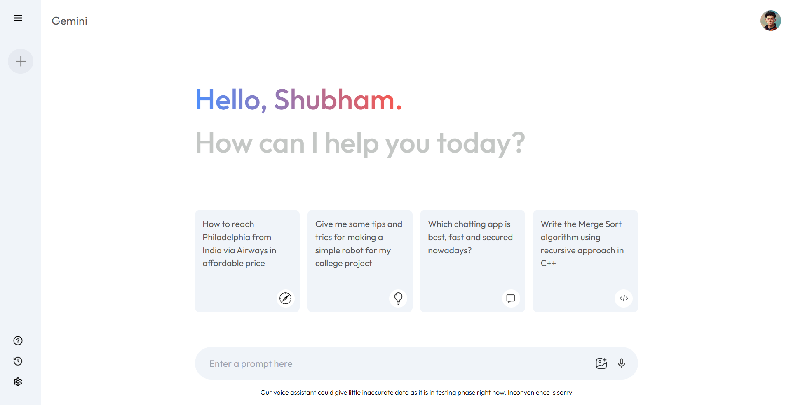

# Gemini

A clone of the Gemini platform built using Next.js and TypeScript. The project utilizes the free Gemini API to simulate the platform's core functionalities. The primary goal was to gain hands-on experience with TypeScript and Next.js in a real-world project.

[Live Demo](https://gemini-phi-black.vercel.app/)

---

## Overview
Gemini Clone replicates the basic functionalities of the Gemini platform, providing insights into:
- API integration and data fetching.
- Building scalable frontends with Next.js and TypeScript.
- Responsive and modern UI design.

---

## Features
- **Real-time Data Fetching:** Uses the Gemini free API for real-time data.
- **TypeScript Integration:** Enhances development with static typing.
- **Responsive Design:** Optimized for both desktop and mobile devices.
- **Next.js Features:** Server-side rendering and API routes for enhanced performance.

---

## Screenshots
### Home Page:


---

## Technologies Used

### Frontend
- **Next.js:** Framework for server-rendered React applications.
- **TypeScript:** Static typing for robust code development.
- **Tailwind CSS:** For modern and responsive styling.

### Backend
- **Gemini API:** Used for fetching real-time data.

### Hosting
- Hosted on Vercel: [Live Demo](https://gemini-phi-black.vercel.app/)

---

## Dependencies
```json
{
  "dependencies": {
    "@google/generative-ai": "^0.17.1",
    "dotenv": "^16.4.5",
    "next": "14.2.6",
    "react": "^18",
    "react-dom": "^18"
  },
  "devDependencies": {
    "@types/node": "^20",
    "@types/react": "^18",
    "@types/react-dom": "^18",
    "eslint": "^8",
    "eslint-config-next": "14.2.6",
    "postcss": "^8",
    "tailwindcss": "^3.4.1",
    "typescript": "^5"
  }
}
```

---

## Installation

### Prerequisites
- Node.js and npm installed.

### Steps
1. Clone the repository:
   ```bash
   git clone https://github.com/shubham-jaishu/Gemini.git
   ```

2. Navigate to the project directory:
   ```bash
   cd Gemini
   ```

3. Install dependencies:
   ```bash
   npm install
   ```

4. Configure environment variables:
   Create a `.env` file and add your API keys and other configurations.

5. Start the development server:
   ```bash
   npm run dev
   ```

6. Open your browser and navigate to:
   ```
   http://localhost:3000
   ```

---

## How It Works
1. **API Integration:** Fetches data from the Gemini API for real-time updates.
2. **Static and Dynamic Pages:** Utilizes Next.js features for rendering.
3. **TypeScript Benefits:** Implements type safety and improves code maintainability.

---

## Future Improvements
- Add user authentication for personalized experiences.
- Expand functionalities to include more Gemini features.
- Optimize API calls for better performance.

---

## Contribution
Contributions are welcome! Feel free to fork the repository and submit a pull request.

---

## Contact
For queries or feedback, please contact [Shubham](mailto:shubhamjaishu@gmail.com).
